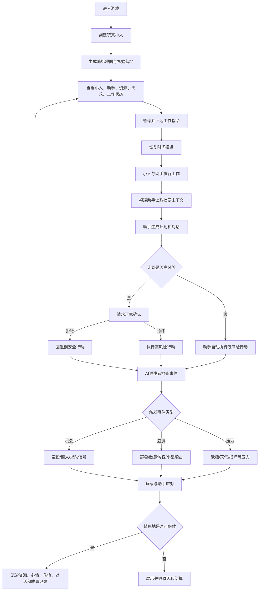
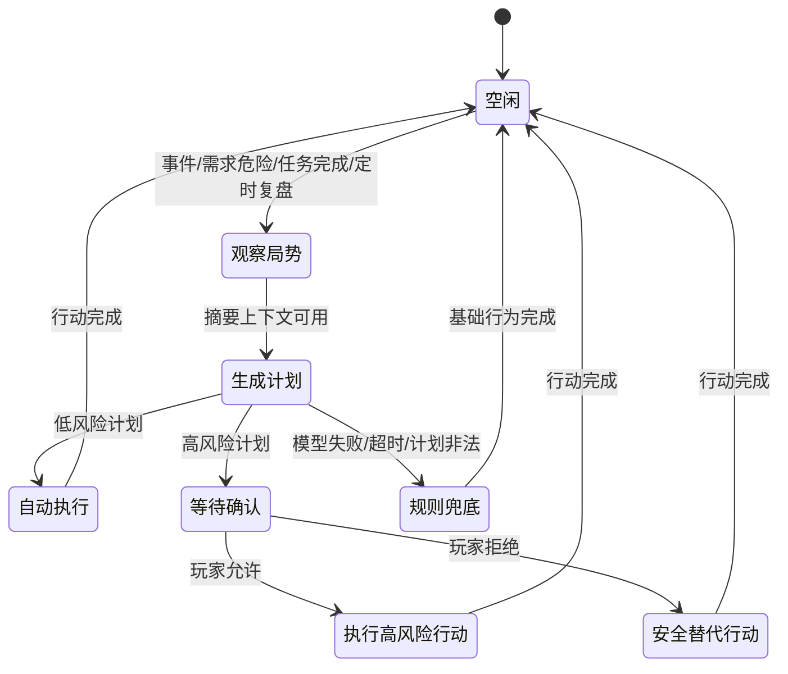
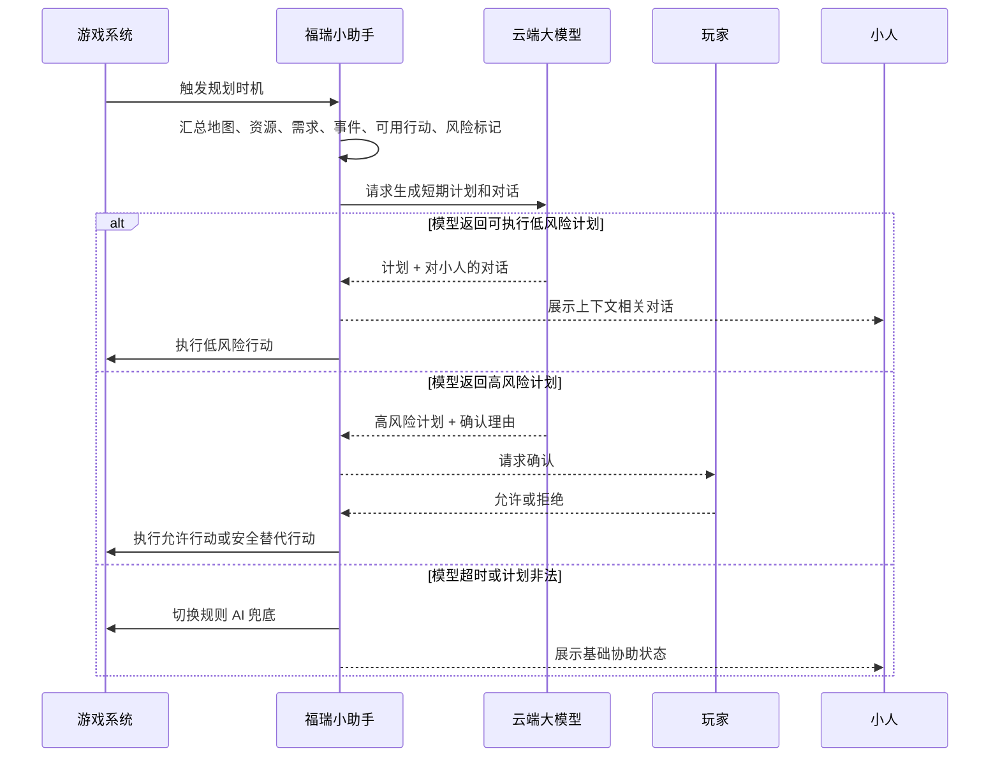

# 产品需求文档：轻量版环世界 V0

> 版本：PRD-001  
> 日期：2026-06-06  
> 产物类型：PC Web Demo 游戏 PRD  
> 关联调研：[环世界技术调研文档.md](../../环世界技术调研文档.md)

## 1. 综述 (Overview)

### 1.1 项目背景与核心问题

《轻量版环世界 V0》是一款面向 PC 浏览器的 2D 俯视半实时殖民地模拟 Demo。产品希望保留 RimWorld 式的核心体验：玩家不是单纯控制角色完成任务，而是在开放生存中通过工作调度、需求管理、随机事件和角色后果生成 emergent story。

V0 的核心差异点是加入一个接入云端大模型的 Q 版福瑞小助手。小助手不是普通提示面板，也不是面向玩家的闲聊机器人；它需要理解当前游戏状况，基于摘要上下文自主规划行动，并根据资源、需求、危险和事件状态与游戏内小人对话。它可以自动执行低风险行为，在高风险行为前必须请求玩家确认。

V0 要证明的核心问题：

1. 单个玩家小人 + 一个 AI 福瑞小助手也能形成可持续的开放生存循环。
2. 工作、需求、事件和 AI 规划可以构成轻量版 RimWorld 的主要可玩性。
3. 大模型助手能让殖民地模拟从“被动数值系统”变成“可对话、可协作、会主动判断局势”的陪伴式生存体验。

### 1.2 目标用户与核心场景

目标用户：

1. 喜欢 RimWorld、Dwarf Fortress、Oxygen Not Included 等殖民地模拟或生存经营游戏的玩家。
2. 喜欢轻策略、角色陪伴、AI 角色互动和 emergent story 的 PC Web 玩家。
3. 黑客松、原型评审或早期试玩场景中的体验者。

核心场景：

玩家在浏览器中创建一个小人，进入随机生成的小地图。地图上有基础资源、可采集物、危险点和初始营地。玩家通过暂停下指令安排采集、搬运、建造、进食、休息等工作。福瑞小助手会读取当前局势，和小人进行上下文相关对话，自动执行低风险协助，并在危险行为前请求玩家确认。AI 讲述者持续触发压力、威胁、机会事件，事件结束后留下资源变化、心情变化、伤痕、对话记录或失败后果，游戏继续开放生存。

### 1.3 核心业务流程 / 用户旅程地图

1. **创建小人** - 玩家设置小人的名字、外观、少量属性、特质和技能倾向。
2. **进入随机营地** - 系统生成随机地图、初始营地、基础资源、可采集物、危险点和事件生成点。
3. **观察状态** - 玩家查看小人、福瑞助手、需求、资源、工作队列和当前事件状态。
4. **暂停下指令** - 玩家暂停游戏，安排采集、搬运、建造、休息、进食或事件应对。
5. **助手自主规划** - 福瑞助手基于摘要上下文生成短期计划、和小人对话，并执行低风险行为。
6. **讲述者触发事件** - 系统触发压力、威胁、机会三类事件，改变资源、环境、危险或奖励。
7. **确认高风险行动** - 当助手计划战斗、探索、消耗稀缺资源或进入危险区域时，玩家必须确认或拒绝。
8. **沉淀事件后果** - 事件产生资源、伤病、心情、关系、对话记录、建筑损失或失败状态。
9. **开放生存循环** - 游戏不设固定通关终点，玩家持续经营直到失败或主动结束。

### 1.4 Mermaid 图（流程/状态/时序）

#### 1.4.1 用户操作流



#### 1.4.2 助手计划状态机



#### 1.4.3 大模型规划时序



## 2. 产品范围与非目标

### 2.1 V0 必做范围

| 模块 | V0 范围 |
| --- | --- |
| 平台 | PC Web Demo，键鼠操作 |
| 视角 | 2D 俯视 |
| 节奏 | 半实时推进，支持暂停、恢复、倍速 |
| 角色 | 一个玩家创建的小人，一个 AI 福瑞小助手 |
| 地图 | 随机生成小地图，包含初始营地、资源、可采集物、危险点、事件生成点 |
| 工作 | 采集、搬运、建造、进食、休息、基础事件应对 |
| 需求 | 饥饿、睡眠、心情 |
| 事件 | 压力、威胁、机会三类代表事件 |
| AI 助手 | 云端大模型规划、游戏内对话、低风险自动执行、高风险确认、规则 AI 兜底 |
| 结局 | 开放生存，失败后展示原因和结算 |

### 2.2 V0 非目标

1. 不做完整身体部位、器官、义体、复杂疾病和详细伤口系统。
2. 不做完整 RimWorld 级别的财富威胁公式、派系外交、任务链、生产链和科技树。
3. 不做多人游戏、联网协作、Mod 系统、DLC 式扩展。
4. 不把福瑞助手与玩家自由聊天作为主功能；V0 对话主要发生在助手与游戏小人之间，并围绕游戏局势展开。
5. 不要求参考图逐像素复刻，只保留浅黄绿色、Q 版、可爱、治愈、陪伴感等视觉方向。

## 3. 核心规则

### 3.1 时间与控制

1. 游戏默认半实时推进。
2. 玩家可以暂停、恢复、调整倍速。
3. 暂停时玩家可以查看状态、安排工作、处理高风险确认。
4. 暂停期间需求和事件不继续推进；恢复后角色继续执行队列。
5. 倍速只改变推进速度，不改变规则结果。

### 3.2 小人与助手

1. 玩家小人由玩家创建，是主要殖民者。
2. 福瑞小助手是固定伙伴，视觉方向参考用户提供图片：浅黄绿色 Q 版福瑞、可爱、治愈、陪伴感。
3. 小人和助手都拥有需求状态；助手至少需要参与饥饿、睡眠、心情相关判断。
4. 助手可根据当前局势对小人说话，话题包括资源短缺、危险临近、任务完成、需求低落、机会事件。
5. 助手可以执行低风险行为，但不应绕过玩家高风险确认。

### 3.3 工作系统

1. 工作是角色行动的基本单位。
2. V0 工作类型包括采集、搬运、建造、进食、休息、避险、基础事件应对。
3. 玩家可为小人下达工作指令。
4. 助手可自动选择低风险协助工作。
5. 工作失败时必须给出用户可理解原因，例如路径不可达、资源不足、角色太饿、危险区域未确认。

### 3.4 需求系统

1. 饥饿会随时间下降，过低时角色优先进食或出现风险提示。
2. 睡眠会随时间下降，过低时角色工作效率降低或主动寻求休息。
3. 心情受饥饿、睡眠、事件结果、受伤、助手对话和环境影响。
4. 需求危险是助手规划触发时机之一。

### 3.5 事件系统

1. AI 讲述者定期评估是否触发事件。
2. V0 事件分为三类：
   - 压力事件：缺粮、天气恶化、建筑损坏。
   - 威胁事件：野兽靠近、敌意访客、小型袭击。
   - 机会事件：空投物资、商人路过、求助信号。
3. 事件必须有开始提示、当前状态、应对方式和结束后果。
4. 事件后果进入开放生存循环，影响资源、需求、心情、伤痕、建筑或故事记录。

### 3.6 AI 助手系统

1. 模型接入默认使用云端大模型 API，PRD 不绑定具体供应商。
2. 触发时机：
   - 事件发生。
   - 任一角色需求进入危险区间。
   - 助手或小人完成关键任务。
   - 每隔一段游戏时间进行轻量复盘。
3. 输入上下文为摘要上下文，包括：
   - 地图摘要。
   - 角色状态。
   - 资源库存。
   - 当前事件。
   - 最近对话。
   - 可用行动列表。
   - 风险标记。
4. 输出内容包括：
   - 短期计划。
   - 对小人的对话内容。
   - 建议行动。
   - 是否需要玩家确认。
5. 可自动执行低风险行动：采集、搬运、跟随、吃饭、休息、避险、低风险建造协助。
6. 需玩家确认的高风险行动：战斗、冒险探索、消耗稀缺资源、拆除关键建筑、让小人进入危险区域。
7. 模型不可用、超时或返回非法计划时，助手切换到规则 AI 兜底，继续执行吃饭、休息、跟随、避险等基础行为。

## 4. 用户故事详述 (User Stories)

### 阶段一：创建与开局

---

#### **US-01: 作为玩家，我希望创建一个自己的小人，以便进入开放生存故事**

* **价值陈述 (Value Statement)**:
  * **作为** 玩家
  * **我希望** 设置小人的名字、外观、少量属性、特质和技能倾向
  * **以便于** 让第一局生存从一个有身份感的角色开始

* **业务规则与逻辑 (Business Logic)**:
  1. **前置条件**: 玩家打开游戏并选择开始新游戏。
  2. **操作流程 (Happy Path)**:
     1. 系统展示创建小人页面。
     2. 玩家输入名字。
     3. 玩家选择外观预设。
     4. 玩家选择少量属性、特质和技能倾向。
     5. 玩家确认创建，系统进入随机地图生成流程。
  3. **异常处理 (Error Handling)**:
     1. 名字为空时，系统提示“请给小人取个名字”。
     2. 未选择属性或特质时，系统使用默认配置并提示玩家可继续。
     3. 玩家返回或刷新时，未确认的创建内容不要求持久保存。

* **页面布局线框图 (ASCII Wireframe)**:

```text
+------------------------------------------------------------+
| 轻量版环世界 V0                         [返回] [开始生存] |
+---------------------------+--------------------------------+
|        小人预览           |  名字                          |
|                           |  [________________________]     |
|        (Q版小人)          |                                |
|                           |  外观                          |
|                           |  [发型] [服装] [颜色]          |
|                           |                                |
|                           |  属性                          |
|                           |  体力 [--|---]  手巧 [---|--]  |
|                           |  感知 [----|-]  意志 [--|---]  |
|                           |                                |
|                           |  特质                          |
|                           |  [勤快] [胆小] [乐观]          |
|                           |                                |
|                           |  技能倾向                      |
|                           |  [采集] [建造] [照料] [战斗]   |
+---------------------------+--------------------------------+
```

* **验收标准 (Acceptance Criteria)**:
  * **场景1: 成功创建小人**
    * **GIVEN** 玩家位于创建小人页面
    * **WHEN** 玩家填写名字并确认创建
    * **THEN** 系统保存小人配置并进入随机地图生成
  * **场景2: 名字为空**
    * **GIVEN** 玩家位于创建小人页面
    * **WHEN** 玩家未输入名字并点击开始生存
    * **THEN** 系统提示“请给小人取个名字”，并停留在当前页面

---

#### **US-02: 作为玩家，我希望进入随机生成的初始营地，以便每局都有新的生存局面**

* **价值陈述 (Value Statement)**:
  * **作为** 玩家
  * **我希望** 开局进入一张随机地图
  * **以便于** 在不同资源和危险分布下展开开放生存

* **业务规则与逻辑 (Business Logic)**:
  1. **前置条件**: 玩家已完成小人创建。
  2. **操作流程 (Happy Path)**:
     1. 系统生成 2D 俯视地图。
     2. 地图必须包含可通行区域、初始营地、基础资源、可采集物、危险点和事件生成点。
     3. 系统生成玩家小人和福瑞小助手。
     4. 小人和助手出现在安全可达的初始营地区域。
     5. 系统展示第一条开局提示。
  3. **异常处理 (Error Handling)**:
     1. 若地图生成结果不可达，系统自动重试生成。
     2. 若资源不足以支撑开局，系统自动补齐最低开局物资。
     3. 若危险点离出生点过近，系统重排危险点。

* **页面布局线框图 (ASCII Wireframe)**:

```text
+------------------------------------------------------------+
| 第1天 08:00  [暂停] [1x] [2x] [3x]        事件：暂无       |
+-------------+--------------------------------------+-------+
| 小人状态    |                                      | 资源  |
| 阿青        |        2D 随机地图                    | 木材  |
| 饥饿 80%    |                                      | 食物  |
| 睡眠 70%    |   [树] [石] [营地] [浆果] [危险点]    | 石头  |
| 心情 65%    |                                      | 药品  |
|             |     小人 @       助手 *               |       |
| 助手状态    |                                      | 工作  |
| 饥饿 90%    |                                      | 采集  |
| 睡眠 80%    |                                      | 搬运  |
| 心情 75%    |                                      | 建造  |
+-------------+--------------------------------------+-------+
| 日志：福瑞助手看了看周围：“这里能活下去，但得先找吃的。” |
+------------------------------------------------------------+
```

* **验收标准 (Acceptance Criteria)**:
  * **场景1: 生成可玩地图**
    * **GIVEN** 玩家完成小人创建
    * **WHEN** 系统进入开局流程
    * **THEN** 地图上出现初始营地、基础资源、可采集物、危险点、小人和助手
  * **场景2: 地图不可达自动重试**
    * **GIVEN** 生成结果导致小人无法到达基础资源
    * **WHEN** 系统检测到不可达
    * **THEN** 系统重新生成或修正地图，直到开局可玩

---

### 阶段二：观察、调度与基础生存

---

#### **US-03: 作为玩家，我希望查看小人、助手、需求、资源和工作状态，以便判断当前生存风险**

* **价值陈述 (Value Statement)**:
  * **作为** 玩家
  * **我希望** 在主界面持续看到关键状态
  * **以便于** 根据饥饿、睡眠、心情、资源和事件调整策略

* **业务规则与逻辑 (Business Logic)**:
  1. **前置条件**: 玩家已进入地图。
  2. **操作流程 (Happy Path)**:
     1. 系统在主界面显示时间、速度、事件状态。
     2. 左侧显示小人与助手的需求状态。
     3. 右侧显示资源库存和工作队列。
     4. 底部显示事件日志、助手对话和关键提示。
  3. **异常处理 (Error Handling)**:
     1. 当需求进入危险区间，状态条变为警示色并写入日志。
     2. 当资源不足，资源项显示缺口提示。
     3. 当没有可执行工作，工作队列显示“暂无可执行工作”。

* **页面布局线框图 (ASCII Wireframe)**:

```text
+------------------------------------------------------------+
| 第2天 14:30  [暂停] [1x] [2x] [3x]  讲述者：平静中        |
+-------------+--------------------------------------+-------+
| 角色        |                                      | 资源  |
| 阿青        |                                      | 食物 3|
| 饥饿 42% !  |                                      | 木材12|
| 睡眠 64%    |             地图区域                 | 石头 5|
| 心情 58%    |                                      | 药品 1|
|             |                                      |       |
| 福瑞助手    |                                      | 工作  |
| 饥饿 76%    |                                      | 1采集 |
| 睡眠 71%    |                                      | 2建造 |
| 心情 82%    |                                      | 3搬运 |
+-------------+--------------------------------------+-------+
| 对话/日志：助手：“阿青有点饿了，我会先把浆果搬回营地。” |
+------------------------------------------------------------+
```

* **验收标准 (Acceptance Criteria)**:
  * **场景1: 查看关键状态**
    * **GIVEN** 玩家位于主界面
    * **WHEN** 游戏时间推进
    * **THEN** 玩家能看到时间、速度、事件、角色需求、资源和工作状态
  * **场景2: 需求危险提示**
    * **GIVEN** 小人饥饿进入危险区间
    * **WHEN** 状态刷新
    * **THEN** 饥饿状态以警示方式呈现，并触发助手规划或提示

---

#### **US-04: 作为玩家，我希望暂停下指令并安排工作，以便在半实时环境中做策略调度**

* **价值陈述 (Value Statement)**:
  * **作为** 玩家
  * **我希望** 暂停游戏后安排采集、搬运、建造、进食、休息和应对工作
  * **以便于** 在事件压力下保持可控性

* **业务规则与逻辑 (Business Logic)**:
  1. **前置条件**: 玩家已进入地图。
  2. **操作流程 (Happy Path)**:
     1. 玩家点击暂停，时间停止推进。
     2. 玩家选择地图对象或角色。
     3. 系统展示可用工作。
     4. 玩家下达工作指令。
     5. 玩家恢复时间，角色执行工作。
  3. **异常处理 (Error Handling)**:
     1. 目标不可达时，系统提示“无法到达该位置”。
     2. 资源不足时，系统提示缺少的资源。
     3. 角色需求过低时，系统提示该角色可能拒绝或中断工作。

* **页面布局线框图 (ASCII Wireframe)**:

```text
+------------------------------------------------------------+
| 第2天 15:00  [继续] [1x] [2x] [3x]  状态：已暂停          |
+-------------+--------------------------------------+-------+
| 角色        |                                      | 指令  |
| 阿青        |       选中：浆果丛                   | [采集]|
| 饥饿 38% !  |                                      | [搬运]|
| 睡眠 61%    |       可用工作：采集                 | [建造]|
| 心情 55%    |       预计产出：食物 +3              | [休息]|
|             |       风险：低                       | [取消]|
| 福瑞助手    |                                      |       |
| 当前计划：  |                                      | 队列  |
| 搬运食物    |                                      | 采集  |
+-------------+--------------------------------------+-------+
| 提示：暂停期间可以安排工作，恢复后角色会按队列执行。       |
+------------------------------------------------------------+
```

* **验收标准 (Acceptance Criteria)**:
  * **场景1: 暂停下指令**
    * **GIVEN** 游戏正在实时推进
    * **WHEN** 玩家点击暂停并下达采集指令
    * **THEN** 时间停止推进，指令进入工作队列
  * **场景2: 恢复执行**
    * **GIVEN** 工作队列中存在采集任务
    * **WHEN** 玩家恢复时间
    * **THEN** 小人或助手开始前往目标并执行采集
  * **场景3: 不可达目标**
    * **GIVEN** 玩家选择不可达目标
    * **WHEN** 玩家尝试下达工作
    * **THEN** 系统提示“无法到达该位置”，且不加入工作队列

---

### 阶段三：AI 福瑞助手

---

#### **US-05: 作为玩家，我希望福瑞小助手读取局势并生成行动计划，以便获得像伙伴一样的协助**

* **价值陈述 (Value Statement)**:
  * **作为** 玩家
  * **我希望** 小助手能根据地图、资源、需求和事件自主规划
  * **以便于** 它不只是装饰角色，而是真正参与生存

* **业务规则与逻辑 (Business Logic)**:
  1. **前置条件**: 玩家已进入地图，助手处于可行动状态。
  2. **触发条件**:
     1. 事件发生。
     2. 小人或助手需求进入危险区间。
     3. 关键任务完成。
     4. 定时复盘触发。
  3. **操作流程 (Happy Path)**:
     1. 系统汇总摘要上下文。
     2. 助手请求云端大模型生成短期计划。
     3. 系统校验计划是否属于可用行动。
     4. 低风险计划自动执行。
     5. 高风险计划进入玩家确认。
  4. **异常处理 (Error Handling)**:
     1. 模型超时、不可用或返回非法行动时，助手切换规则 AI 兜底。
     2. 兜底期间助手只执行吃饭、休息、跟随、避险等基础行为。
     3. UI 显示“助手暂时只做基础协助”。

* **页面布局线框图 (ASCII Wireframe)**:

```text
+------------------------------------------------------------+
| 助手计划面板                                  [收起]       |
+------------------------------------------------------------+
| 当前局势摘要：                                             |
| - 食物偏低，阿青饥饿 38%，附近有浆果丛                     |
| - 木材足够建一个简易睡点                                   |
| - 讲述者状态：可能触发压力事件                             |
+------------------------------------------------------------+
| 福瑞助手计划：                                             |
| 1. 先把附近浆果搬回营地              风险：低  [自动执行] |
| 2. 协助建造简易睡点                  风险：低  [自动执行] |
| 3. 暂不靠近北侧危险点                风险：高  [需确认]   |
+------------------------------------------------------------+
| 状态：模型规划正常                                         |
+------------------------------------------------------------+
```

* **验收标准 (Acceptance Criteria)**:
  * **场景1: 低风险计划自动执行**
    * **GIVEN** 食物不足且附近存在可采集食物
    * **WHEN** 助手触发规划并生成采集/搬运计划
    * **THEN** 系统校验计划为低风险后，助手自动执行
  * **场景2: 模型失败兜底**
    * **GIVEN** 助手触发规划
    * **WHEN** 模型超时或返回不可执行计划
    * **THEN** 助手切换规则 AI，继续执行基础协助，游戏不中断

---

#### **US-06: 作为玩家，我希望助手根据当前状况与小人对话，以便生存过程产生角色故事感**

* **价值陈述 (Value Statement)**:
  * **作为** 玩家
  * **我希望** 福瑞助手能围绕局势与小人说话
  * **以便于** 资源压力、危险和事件后果不只是数值变化，而能形成角色互动

* **业务规则与逻辑 (Business Logic)**:
  1. **前置条件**: 游戏内存在小人和助手。
  2. **操作流程 (Happy Path)**:
     1. 助手在规划、事件发生、需求危险或任务完成时生成对话。
     2. 对话内容必须与当前游戏状态相关。
     3. 对话展示在底部日志或角色气泡中。
     4. 对话可影响心情表现，但 V0 不要求复杂关系系统。
  3. **异常处理 (Error Handling)**:
     1. 模型生成内容为空时，系统使用预设短句。
     2. 模型生成内容与游戏状态不匹配时，系统丢弃并使用预设短句。
     3. 对话过长时，系统截断为适合 UI 展示的短句。

* **页面布局线框图 (ASCII Wireframe)**:

```text
+------------------------------------------------------------+
| 地图                                                       |
|                                                            |
|       阿青 @                                               |
|        ^                                                   |
|        | “我快饿晕了……”                                   |
|                                                            |
|       助手 *                                               |
|        ^                                                   |
|        | “别急，我去把浆果搬回来，你先别靠近北边。”         |
|                                                            |
+------------------------------------------------------------+
| 对话日志                                                   |
| 15:20 阿青：我快饿晕了……                                  |
| 15:21 福瑞助手：别急，我去把浆果搬回来，你先别靠近北边。    |
+------------------------------------------------------------+
```

* **验收标准 (Acceptance Criteria)**:
  * **场景1: 生成上下文相关对话**
    * **GIVEN** 小人饥饿且附近存在食物
    * **WHEN** 助手触发规划
    * **THEN** 助手对话提到食物、饥饿或安全行动
  * **场景2: 对话兜底**
    * **GIVEN** 模型返回空对话
    * **WHEN** 系统展示对话
    * **THEN** 使用预设短句代替，且不影响游戏推进

---

### 阶段四：事件与风险确认

---

#### **US-07: 作为玩家，我希望 AI 讲述者触发压力、威胁、机会事件，以便开放生存持续产生变化**

* **价值陈述 (Value Statement)**:
  * **作为** 玩家
  * **我希望** 游戏持续触发不同类型事件
  * **以便于** 生存过程不是重复采集和建造，而是不断产生需要应对的局势

* **业务规则与逻辑 (Business Logic)**:
  1. **前置条件**: 玩家已进入开放生存循环。
  2. **操作流程 (Happy Path)**:
     1. 讲述者按节奏评估事件触发。
     2. 系统选择压力、威胁或机会事件。
     3. 系统展示事件标题、描述、风险和建议应对方式。
     4. 事件改变地图、资源、危险或奖励。
     5. 事件结束后写入日志并影响后续生存状态。
  3. **异常处理 (Error Handling)**:
     1. 当前地图不满足事件条件时，讲述者改选其他事件。
     2. 连续威胁过密时，系统应避免立即再次触发高压威胁。
     3. 事件目标不可达时，系统应重选目标或转为可达位置。

* **页面布局线框图 (ASCII Wireframe)**:

```text
+------------------------------------------------------------+
| 事件：北侧灌木里有动静                         [定位]     |
+------------------------------------------------------------+
| 类型：威胁                                                 |
| 描述：一只饥饿的野兽正在靠近营地，它可能被食物吸引。       |
| 风险：中                                                   |
| 建议：搬走露天食物，避免小人独自靠近北侧。                 |
+------------------------------------------------------------+
| 可选应对                                                   |
| [搬运食物] [让助手警戒] [派小人查看] [忽略]                |
+------------------------------------------------------------+
| 助手：“我不建议阿青一个人过去，我可以先把食物收起来。”    |
+------------------------------------------------------------+
```

* **验收标准 (Acceptance Criteria)**:
  * **场景1: 触发三类事件**
    * **GIVEN** 玩家持续生存一段时间
    * **WHEN** 讲述者触发事件
    * **THEN** 压力、威胁、机会三类事件都存在可触发代表事件
  * **场景2: 事件不可用改选**
    * **GIVEN** 当前地图不满足某事件条件
    * **WHEN** 讲述者尝试触发该事件
    * **THEN** 系统改选其他可用事件或延后触发

---

#### **US-08: 作为玩家，我希望确认或干预助手的高风险行动，以便保持关键决策的控制权**

* **价值陈述 (Value Statement)**:
  * **作为** 玩家
  * **我希望** 助手执行危险计划前需要我确认
  * **以便于** AI 自主性不会破坏玩家对生存后果的掌控

* **业务规则与逻辑 (Business Logic)**:
  1. **前置条件**: 助手生成了高风险计划。
  2. **高风险行动包括**: 战斗、冒险探索、消耗稀缺资源、拆除关键建筑、让小人进入危险区域。
  3. **操作流程 (Happy Path)**:
     1. 系统暂停或突出显示确认请求。
     2. 确认面板展示行动、原因、风险、预计收益和替代方案。
     3. 玩家选择允许或拒绝。
     4. 允许时助手执行计划；拒绝时助手执行安全替代行动。
  4. **异常处理 (Error Handling)**:
     1. 玩家长时间不处理时，助手不执行高风险行动。
     2. 事件紧急时，助手最多执行避险类安全行动。
     3. 高风险行动目标失效时，确认请求自动关闭并写入日志。

* **页面布局线框图 (ASCII Wireframe)**:

```text
+------------------------------------------------------------+
| 高风险行动确认                                             |
+------------------------------------------------------------+
| 福瑞助手计划：让阿青靠近北侧危险点查看野兽位置             |
| 原因：确认威胁来源，决定是否搬迁营地                       |
| 风险：可能受伤，可能触发战斗                               |
| 收益：提前发现威胁，减少被突袭概率                         |
+------------------------------------------------------------+
| 安全替代：助手先搬走露天食物，并让阿青留在营地             |
+------------------------------------------------------------+
| [允许执行]                         [拒绝，执行安全替代]     |
+------------------------------------------------------------+
```

* **验收标准 (Acceptance Criteria)**:
  * **场景1: 高风险行动请求确认**
    * **GIVEN** 助手计划进入危险区域
    * **WHEN** 系统识别该行动为高风险
    * **THEN** 游戏展示确认面板，且未确认前不执行该行动
  * **场景2: 玩家拒绝**
    * **GIVEN** 确认面板正在展示
    * **WHEN** 玩家点击拒绝
    * **THEN** 助手放弃高风险行动并执行安全替代行动

---

### 阶段五：后果与开放生存

---

#### **US-09: 作为玩家，我希望事件后果进入开放生存循环，以便每次选择都留下故事痕迹**

* **价值陈述 (Value Statement)**:
  * **作为** 玩家
  * **我希望** 事件结束后影响资源、心情、伤痕、建筑或日志
  * **以便于** 开放生存不是重置式关卡，而是连续积累的故事

* **业务规则与逻辑 (Business Logic)**:
  1. **前置条件**: 任一事件进入结算。
  2. **操作流程 (Happy Path)**:
     1. 系统根据玩家和助手应对结果结算事件。
     2. 事件后果改变资源、需求、心情、角色状态、建筑或危险状态。
     3. 系统记录事件日志和关键对话。
     4. 若殖民地仍可继续，游戏返回开放生存循环。
     5. 若失败条件达成，展示失败原因和结算。
  3. **异常处理 (Error Handling)**:
     1. 若事件结算数据缺失，系统使用最小后果并写入日志。
     2. 若角色均无法行动，系统进入失败结算。
     3. 若资源为负数，系统修正为 0 并记录资源耗尽。

* **页面布局线框图 (ASCII Wireframe)**:

```text
+------------------------------------------------------------+
| 事件结算：北侧灌木里的动静                                 |
+------------------------------------------------------------+
| 结果：成功避开野兽，营地没有受损                           |
| 资源变化：食物 -1，木材 0                                  |
| 状态变化：阿青心情 -5，助手心情 +3                         |
| 故事记录：助手说服阿青没有贸然靠近危险点                   |
+------------------------------------------------------------+
| [继续生存]                         [查看日志]              |
+------------------------------------------------------------+
```

* **验收标准 (Acceptance Criteria)**:
  * **场景1: 成功回到开放生存**
    * **GIVEN** 事件已被成功应对
    * **WHEN** 玩家点击继续生存
    * **THEN** 游戏返回主界面，事件后果保留在当前局中
  * **场景2: 失败结算**
    * **GIVEN** 小人无法继续行动且助手无法完成基础维持
    * **WHEN** 系统结算事件或需求崩溃
    * **THEN** 游戏展示失败原因和本局记录

---

## 5. 验收测试总表

| 测试项 | 验收目标 |
| --- | --- |
| 创建角色 | 能完成名字、外观、属性、特质选择并进入游戏 |
| 随机地图 | 多次开局能生成可行走地图、基础资源和初始营地 |
| 半实时控制 | 暂停可下指令，恢复后执行，倍速不破坏需求和事件节奏 |
| 工作闭环 | 小人和助手能完成采集、搬运、建造、进食、休息 |
| 需求闭环 | 饥饿、睡眠、心情会随时间变化，并影响行为、提示和风险 |
| 事件闭环 | 压力、威胁、机会三类事件都能触发、应对并产生可见后果 |
| AI 规划 | 助手能基于摘要上下文生成合理短期计划，并执行低风险行动 |
| AI 对话 | 助手能根据资源、需求、事件或危险状态与小人产生上下文相关对话 |
| 高风险确认 | 助手试图执行危险行动时，玩家必须看到确认入口并能允许或拒绝 |
| 兜底 | 模型超时、失败或返回非法行动时，助手切换到规则 AI，游戏不中断 |

## 6. PRD 总集台账行

```markdown
| PRD-001 | 轻量版环世界 V0 | 面向 PC Web Demo 的 2D 俯视半实时开放生存游戏。V0 保留 RimWorld 式工作、需求、事件循环，并加入接入云端大模型的 Q 版福瑞小助手。玩家创建一个小人进入随机地图，通过暂停下指令安排采集、搬运、建造、进食、休息和事件应对。小助手基于摘要上下文自主规划、与游戏小人对话、自动执行低风险行为，并在战斗、探索、稀缺资源消耗、拆除关键建筑或进入危险区域前请求玩家确认。V0 不做完整身体部位、复杂战斗、派系外交、科技树、生产链、Mod 系统或玩家自由聊天机器人。 | docs/prd/PRD-001.md |
```
