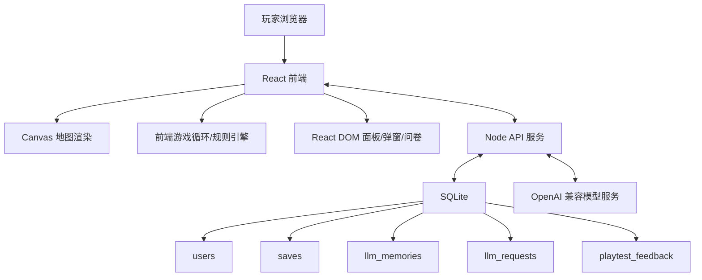

# 技术方案：轻量版环世界 V0 完整 Demo

> 版本：TECH-001  
> 日期：2026-06-06  
> 关联 PRD：[PRD-001.md](../prd/PRD-001.md)

## 1. 技术目标

本技术方案服务《轻量版环世界 V0》完整 30 分钟开放生存 Demo。实现目标是用前后端分离方式交付一个可登录、可多存档、可运行 40x40 俯视地图、可接入云端大模型助手的 PC Web Demo。

技术边界：

1. 前端负责游戏循环、Canvas 地图渲染、角色状态、寻路、工作队列、需求衰减、事件推进和 UI 展示。
2. 后端负责账号、会话、SQLite 存档、LLM 代理、调用节流、计划缓存和局后问卷。
3. LLM 只生成计划和对白，不直接修改游戏状态。
4. 游戏规则层必须校验 LLM 的 JSON 动作列表，只有合法动作才可执行。

## 2. 总体架构



## 3. 前端方案

### 3.1 技术栈

| 模块 | 方案 |
| --- | --- |
| UI 框架 | React |
| 地图渲染 | Canvas |
| 状态管理 | 前端集中状态，按存档序列化 |
| 网络通信 | REST API |
| 样式 | 普通 CSS 或组件级 CSS，优先保证 Demo 可读性 |

### 3.2 页面结构

| 页面/视图 | 说明 |
| --- | --- |
| 登录/注册页 | 邮箱密码注册、登录、错误提示 |
| 存档列表页 | 创建、读取、删除存档，展示最近保存时间和游戏时长 |
| 创建小人页 | 名字、外观、属性、特质、技能倾向 |
| 游戏主界面 | Canvas 地图 + 环世界式信息面板 |
| 高风险确认弹窗 | 展示助手计划、风险、收益、替代方案 |
| 事件结算弹窗 | 展示事件后果和继续入口 |
| 局后问卷页 | 评分、继续意愿、喜欢点、困惑点、自由反馈 |

### 3.3 游戏主界面布局

主界面采用环世界式面板：

```text
+------------------------------------------------------------+
| 时间/速度/暂停/当前事件/保存状态                           |
+-------------+--------------------------------------+-------+
| 小人/助手    |                                      | 资源  |
| 需求/伤势    |              Canvas 地图             | 工作  |
| 当前任务     |                                      | 建造  |
| 助手计划     |                                      | 事件  |
+-------------+--------------------------------------+-------+
| 日志 / 助手与小人对话 / 系统提示                           |
+------------------------------------------------------------+
```

### 3.4 前端游戏循环

1. 游戏循环在前端运行。
2. 支持暂停、恢复、1x/2x/3x 倍速。
3. 暂停时停止需求衰减、事件推进和角色移动，但允许 UI 操作和下指令。
4. 每个模拟 tick 处理：
   - 角色需求衰减。
   - 工作队列推进。
   - 寻路和移动。
   - 建造/采集/搬运进度。
   - 事件计时和结算。
   - 助手规划触发条件检查。
   - 自动保存计时。

### 3.5 Canvas 地图

1. 地图为 40x40 格子。
2. Canvas 渲染地形、资源、建筑、角色、危险区、事件目标和选中状态。
3. React DOM 只负责面板、按钮、弹窗和日志，不直接渲染每个格子。
4. Canvas 点击转换为地图坐标，交给规则层判断可选对象和可用指令。

### 3.6 前端存档序列化

前端需能把当前局序列化为一个 `gameState` 对象，至少包含：

```json
{
  "version": "v0",
  "elapsedSeconds": 0,
  "map": {},
  "characters": [],
  "resources": {},
  "buildings": [],
  "jobs": [],
  "events": [],
  "storyLog": [],
  "assistantMemory": {}
}
```

实现要求：

1. 所有运行中对象必须有稳定 ID。
2. 存档读取后必须恢复地图、角色、资源、建筑、工作队列、事件状态和助手短记忆。
3. 存档版本字段必须保留，方便后续迁移。

## 4. 后端方案

### 4.1 技术栈

| 模块 | 方案 |
| --- | --- |
| 运行时 | Node.js |
| API | REST |
| 数据库 | SQLite |
| 认证 | 邮箱密码 + 会话 |
| LLM | OpenAI 兼容接口 |

### 4.2 环境变量

| 变量 | 说明 |
| --- | --- |
| `DATABASE_URL` | SQLite 数据库路径 |
| `SESSION_SECRET` | 会话签名密钥 |
| `OPENAI_API_KEY` | OpenAI 兼容接口密钥 |
| `OPENAI_BASE_URL` | OpenAI 兼容接口地址 |
| `OPENAI_MODEL` | 使用的模型名称 |
| `LLM_TIMEOUT_MS` | LLM 请求超时时间 |
| `LLM_RATE_LIMIT_PER_MINUTE` | 每用户/每存档调用频率限制 |

### 4.3 SQLite 表

#### users

| 字段 | 说明 |
| --- | --- |
| id | 用户 ID |
| email | 邮箱，唯一 |
| password_hash | 密码哈希 |
| created_at | 创建时间 |
| updated_at | 更新时间 |

#### saves

| 字段 | 说明 |
| --- | --- |
| id | 存档 ID |
| user_id | 所属用户 |
| name | 存档名 |
| game_state_json | 当前手动保存状态 |
| autosave_json | 自动保存状态 |
| elapsed_seconds | 当前局游戏时长 |
| last_saved_at | 最近保存时间 |
| created_at | 创建时间 |
| updated_at | 更新时间 |

#### llm_memories

| 字段 | 说明 |
| --- | --- |
| id | 记忆 ID |
| save_id | 所属存档 |
| memory_json | 本局短记忆 |
| updated_at | 更新时间 |

#### llm_requests

| 字段 | 说明 |
| --- | --- |
| id | 请求 ID |
| user_id | 用户 ID |
| save_id | 存档 ID |
| context_hash | 摘要上下文哈希 |
| response_json | 模型返回或缓存结果 |
| status | success / fallback / error |
| created_at | 创建时间 |

#### playtest_feedback

| 字段 | 说明 |
| --- | --- |
| id | 反馈 ID |
| user_id | 用户 ID |
| save_id | 存档 ID |
| elapsed_seconds | 提交时游戏时长 |
| ending_type | reached_30m / failed / quit / skipped |
| rating | 1-5 分，可为空 |
| want_continue | yes / neutral / no，可为空 |
| favorite_text | 最喜欢的点 |
| confusing_text | 最困惑的点 |
| free_text | 自由反馈 |
| created_at | 创建时间 |

## 5. API 设计

### 5.1 Auth

| 方法 | 路径 | 说明 |
| --- | --- | --- |
| POST | `/api/auth/register` | 邮箱密码注册 |
| POST | `/api/auth/login` | 登录 |
| POST | `/api/auth/logout` | 登出 |
| GET | `/api/auth/me` | 获取当前用户 |

### 5.2 Saves

| 方法 | 路径 | 说明 |
| --- | --- | --- |
| GET | `/api/saves` | 获取当前用户存档列表 |
| POST | `/api/saves` | 创建新存档 |
| GET | `/api/saves/:id` | 读取存档 |
| PUT | `/api/saves/:id` | 手动保存当前存档 |
| PUT | `/api/saves/:id/autosave` | 写入自动保存快照 |
| DELETE | `/api/saves/:id` | 删除存档 |

### 5.3 LLM

| 方法 | 路径 | 说明 |
| --- | --- | --- |
| POST | `/api/llm/plan` | 提交游戏摘要上下文，获取助手计划和对白 |

请求体摘要：

```json
{
  "saveId": "save_001",
  "context": {
    "mapSummary": {},
    "characters": [],
    "resources": {},
    "currentEvent": null,
    "recentDialogue": [],
    "availableActions": [],
    "riskFlags": []
  }
}
```

响应体摘要：

```json
{
  "status": "success",
  "dialogue": "别急，我先把浆果搬回来。",
  "planSummary": "优先补充食物并避免北侧危险区。",
  "actions": [
    {
      "type": "gather",
      "actorId": "assistant",
      "targetId": "berry_12",
      "risk": "low",
      "requiresConfirmation": false
    }
  ],
  "fallbackReason": null
}
```

### 5.4 Feedback

| 方法 | 路径 | 说明 |
| --- | --- | --- |
| POST | `/api/feedback` | 提交局后问卷或跳过记录 |

## 6. LLM 协议与安全边界

### 6.1 模型输入

模型只接收摘要上下文，不接收完整地图对象。摘要必须包含：

1. 地图摘要。
2. 角色需求、伤势、当前位置、当前任务。
3. 四资源库存。
4. 当前事件。
5. 最近对话和故事日志摘要。
6. 可用行动白名单。
7. 风险标记。

### 6.2 模型输出

模型必须输出 JSON，包含：

1. `dialogue`：给小人的短对话。
2. `planSummary`：短期计划摘要。
3. `actions`：动作数组。
4. `requiresConfirmation`：是否需要玩家确认。

动作白名单：

| 动作 | 说明 | 默认风险 |
| --- | --- | --- |
| gather | 采集资源 | low |
| haul | 搬运资源 | low |
| build | 建造指定建筑 | medium |
| eat | 进食 | low |
| sleep | 休息 | low |
| avoid | 避开危险区 | low |
| assist_build | 协助建造 | low |
| warn | 对小人发出提醒 | low |
| request_confirm | 请求玩家确认高风险行动 | high |

### 6.3 校验规则

1. 后端校验 JSON 格式、必填字段和动作白名单。
2. 后端记录请求和响应，用于缓存和排查。
3. 前端规则层再次校验目标是否存在、路径是否可达、资源是否足够、角色是否能行动、风险是否需要确认。
4. 任一校验失败时，该动作不得执行。
5. 模型不得直接写入存档，不得直接修改资源、伤势、事件状态或地图。

### 6.4 节流与缓存

1. 后端按用户和存档限制 LLM 调用频率。
2. 摘要上下文生成哈希，短时间相同哈希可复用缓存计划。
3. LLM 超时、网络失败、非法 JSON、非法动作时返回 fallback 状态。
4. 前端收到 fallback 状态后切换规则 AI，展示“助手暂时只做基础协助”。

## 7. 存档策略

1. 存档列表只显示当前登录用户的存档。
2. 创建新局时写入初始存档记录。
3. 手动保存写入 `game_state_json`。
4. 自动保存写入 `autosave_json`，不覆盖手动保存状态。
5. 读取存档时优先让玩家选择继续手动保存状态或 autosave 状态；若只做 V0 简化，可默认读取最近更新时间更晚的一份。
6. 删除存档必须校验当前用户拥有该存档，并需要前端二次确认。

## 8. 试玩反馈

1. 前端在达到 30 分钟、失败结算或主动退出时展示问卷。
2. 问卷可以提交，也可以跳过。
3. 提交和跳过都调用 `/api/feedback`。
4. 反馈不影响存档继续读取。
5. 后续评估 Demo 时优先查看评分、继续意愿、最困惑的点和自由反馈。

## 9. 测试计划

### 9.1 账号与存档

1. 邮箱密码注册成功后进入存档列表。
2. 登录成功后只看到当前用户存档。
3. 手动保存、自动保存、读取、删除存档均可用。
4. 刷新页面后可恢复登录态和最近存档。

### 9.2 30 分钟可玩性

1. 新局能生成 40x40 可行走地图、安全出生点、基础资源、危险点和事件点。
2. 玩家能从零采集资源、建房间、安排睡眠/进食。
3. 30 分钟内能触发 6-8 个事件，且事件后果保留到当前局。

### 9.3 核心系统

1. 房间封闭性和舒适度影响睡眠或心情。
2. 身体部位受伤能影响角色状态，严重时昏迷或死亡。
3. 食物、木材、石材、药品在采集、建造、治疗和事件中被正确消耗或增加。

### 9.4 AI 助手

1. 正常模型返回时，助手能生成上下文相关计划和对小人的对白。
2. 低风险动作自动执行，高风险动作弹出确认。
3. 模型失败、超时、非法 JSON、非法动作时，规则 AI 兜底且游戏不中断。

### 9.5 自由试玩反馈

1. 失败、主动退出或达到 30 分钟后展示局后问卷。
2. 问卷能记录评分、文字反馈、是否想继续玩、最喜欢的点、最困惑的点。

## 10. 实施顺序建议

1. 搭建 React + Node + SQLite 基础工程。
2. 实现账号、会话和存档 CRUD。
3. 实现 40x40 Canvas 地图、创建小人、基础资源和建造。
4. 实现前端游戏循环、需求、工作队列、寻路和四资源闭环。
5. 实现房间系统、身体部位战斗和治疗。
6. 实现 9 个事件池和 30 分钟事件节奏。
7. 接入 LLM 代理、JSON 动作协议、校验、节流、缓存和兜底。
8. 实现局后问卷和试玩反馈存储。
9. 做 30 分钟自由试玩，按反馈调整节奏和 UI。
