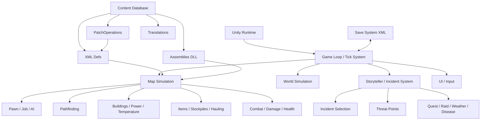
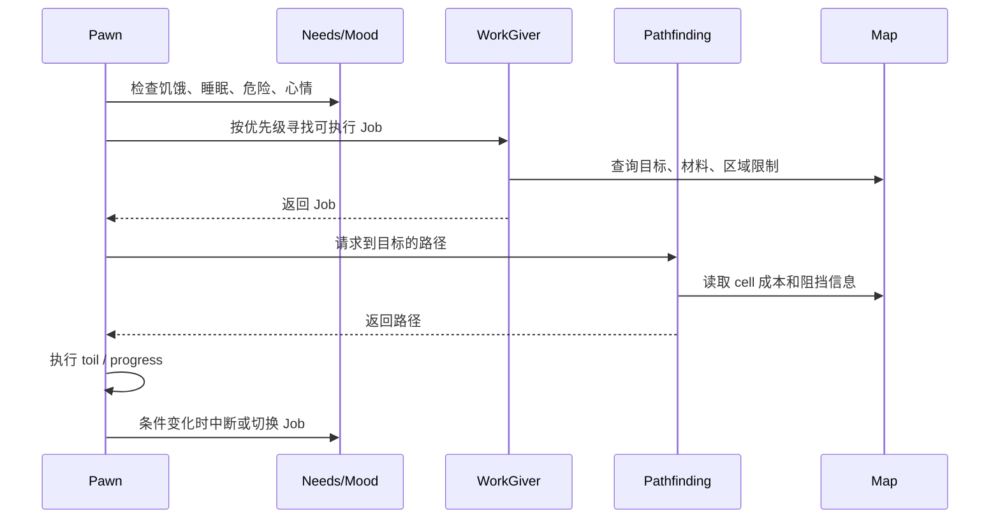
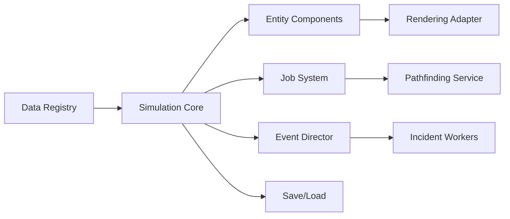

# 环世界 RimWorld 技术调研文档

> 调研日期：2026-06-06  
> 对象版本：以 RimWorld PC 版 1.6 时代为主，覆盖 Odyssey 扩展后的系统变化。  
> 说明：RimWorld 是闭源商业游戏。本文不包含反编译代码，架构部分基于官方说明、公开 Modding 文档、Wiki 资料和可观察系统行为归纳。

## 1. 项目概览

RimWorld 是 Ludeon Studios 开发的科幻殖民地模拟游戏。官方将其定位为 “由智能 AI Storyteller 驱动的科幻殖民地模拟”，但更关键的产品定位不是竞技胜负，而是 “story generator”：系统通过事件、角色关系、资源压力、战斗与灾害共同生成可叙事的殖民地故事。

核心玩家体验可以拆成四层：

| 层级 | 作用 | 典型系统 |
| --- | --- | --- |
| 生存经营层 | 维持殖民地可运行 | 食物、温度、医疗、建造、工作优先级、库存 |
| 角色模拟层 | 让每个殖民者像具体的人 | 需求、心情、技能、特质、社交关系、伤病、成瘾 |
| 事件导演层 | 控制故事节奏和压力曲线 | AI Storyteller、袭击、贸易、疾病、天气、任务 |
| 内容扩展层 | 让游戏长期可演化 | XML Def、PatchOperation、C# Assembly、Harmony、Steam Workshop |

官方资料显示，RimWorld 首次公开发布于 2013-11-04，支持 Windows、macOS、Linux，并通过 DRM-free 下载与 Steam 等渠道发行。主线 PC 版截至 2025 年进入 1.6/Odyssey 时代，免费 1.6 更新包含性能优化、地图生成、UI、建造规划和 caravan 等系统改动；Odyssey 是第五个扩展包，于 2025-07-11 发布。

## 2. 设计目标与系统哲学

RimWorld 的关键技术目标不是 “公平地模拟所有东西”，而是 “用足够可信的模拟制造故事”。这决定了它的系统设计有三个特征：

1. **局部高细节，整体可压缩**  
   游戏会细到每个 colonist 的胃、腿、眼睛、关系、心情与当前 job，但不会对整个世界做同等粒度的实时模拟。殖民地地图是高频模拟对象，世界地图、其他派系和事件则更偏抽象。

2. **数据驱动内容，代码驱动行为**  
   大量物品、地形、配方、研究、建筑、种族、任务参数通过 XML Def 描述；更复杂的行为由 C# 类实现。Modding 文档明确指出 Def 文件存放在 `Mods/Core/Defs` 一类目录中，ThingDef、RecipeDef、ResearchProjectDef、TerrainDef 等 Def 负责把通用逻辑参数化为具体内容。

3. **导演系统压在模拟系统之上**  
   AI Storyteller 不只是随机数发生器，而是根据玩家当前状态、故事节奏和威胁预算选择事件。官方称其受到 Left 4 Dead 的 AI Director 启发，会分析局势并选择 “适合故事” 的事件。Wiki 资料进一步显示，难度、讲述者、殖民地财富、人口与适应因子会共同影响袭击点数和威胁规模。

## 3. 运行平台与技术栈

| 项目 | 结论 |
| --- | --- |
| 游戏引擎 | Unity |
| 主要语言 | C# |
| 内容数据 | XML Def、Patch XML、语言包、纹理/音频资源 |
| 存档格式 | XML 风格的 `.rws` 存档，保存游戏状态 |
| 官方 PC 平台 | Windows、macOS、Linux |
| 主流分发 | Steam、DRM-free 下载、GOG 等 |
| 扩展生态 | Steam Workshop、Ludeon Forum、GitHub、Nexus 等 |
| 控制台版 | PS4 / Xbox One，Double Eleven 移植，2022-07-29 发布 |

从技术选型上看，RimWorld 适合用 Unity/C# 的原因很明显：它需要稳定的 2D 渲染、跨平台构建、可调试的 Mono/.NET 生态，以及相对开放的 mod assembly 机制。相比画面表现，它更重视长时间仿真、对象状态管理、寻路、调度、事件系统和可扩展数据管线。

## 4. 高层架构推断

下面是根据公开 Modding 入口和系统行为归纳的逻辑架构：



架构核心是一个 tick 驱动的模拟循环。地图内的 pawn、建筑、电网、温度、火灾、作物、动物、敌人和物品都需要周期性更新；世界地图和故事事件以较低频率或抽象状态推进。Mod 系统通过内容数据库在启动期加载 Def，并允许 C# assembly 扩展或修改运行时行为。

## 5. 核心领域模型

### 5.1 Pawn

Pawn 是 RimWorld 最重要的实体类型，可表示殖民者、囚犯、敌人、动物、机械体等。一个 Pawn 不是简单单位，而是多个子系统的聚合：

| 子系统 | 说明 |
| --- | --- |
| 身体系统 | 身体部位、伤口、疾病、药物、义体、缺失器官 |
| 需求系统 | 饥饿、睡眠、娱乐、舒适、环境等 |
| 心情系统 | thought/memory 叠加形成 mood，低心情触发 mental break |
| 技能系统 | 射击、近战、建造、种植、医疗、研究等 |
| 工作系统 | 按优先级寻找 job，如建造、搬运、烹饪、采矿 |
| 社交系统 | 亲属、恋人、配偶、仇恨、社交互动 |
| 装备系统 | 武器、服装、护甲、库存 |
| AI 状态 | 当前 job、寻路目标、危险反应、战斗姿态 |

这种聚合式设计让单个 pawn 成为 “故事节点”。例如一次袭击不是只有战斗结果，还会产生伤口、失去器官、亲友死亡、战俘招募、心情崩溃、医疗资源消耗和未来复仇等后果。

### 5.2 Thing / ThingDef

公开 Modding 文档显示，ThingDef 是最常见的 Def 类型之一。可以把 Thing 理解为地图和库存中的通用对象实例，而 ThingDef 是它的模板定义。

常见 Thing 类型包括：

| 类型 | 示例 |
| --- | --- |
| 资源 | 钢铁、木材、布料、药品、食物 |
| 建筑 | 墙、门、床、工作台、电池、炮塔 |
| 植物 | 土豆、水稻、树木、菌类 |
| 装备 | 枪械、近战武器、护甲、服装 |
| 生物 | 人类、动物、机械体 |

数据驱动的好处是，添加一把新武器、一个新作物、一个新建筑，通常可以先通过 XML 定义完成；只有当它需要全新行为时，才需要 C# 代码。

### 5.3 Map 与 Cell

RimWorld 的局部地图可以视为二维格网。每个 cell 关联地形、屋顶、温度、光照、可通行性、物品堆叠、建筑占用与区域标记。许多系统都依赖 cell 级查询：

| 系统 | 依赖的 cell 信息 |
| --- | --- |
| 寻路 | 可行走性、门、危险、代价、阻挡物 |
| 温度 | 房间边界、墙体、热源、冷源、室外连接 |
| 建造 | 蓝图、地形支持、材料、工作量 |
| 战斗 | 掩体、射线、距离、命中、爆炸半径 |
| 美观/心情 | 房间 impressiveness、脏污、空间、光照 |
| 区域限制 | stockpile、home area、allowed area、pen |

Odyssey/1.6 之后官方提到 pathfinding 已经变成 multithreaded 和 batched，lighting 也进行了多线程优化。这说明在晚期殖民地中，寻路与光照/地图计算是可观的性能热点。

## 6. Tick 与仿真循环

RimWorld 这类游戏的关键不是每帧做所有逻辑，而是把不同系统分配到不同节奏：

| 频率 | 典型任务 |
| --- | --- |
| 每帧 | 输入、UI、相机、渲染插值 |
| 高频 tick | Pawn job、寻路、战斗、火灾、即时交互 |
| 中频 tick | 需求下降、心情刷新、温度扩散、作物成长 |
| 低频 tick | 故事事件、疾病检查、世界事件、caravan 计算 |
| 启动/加载期 | Def 加载、PatchOperation、mod assembly 初始化 |

这种分层调度能避免把所有逻辑压到单帧里，也让系统有机会做批处理。1.6 的官方更新提到把许多系统的工作负载分散，并优化 caravan foraging、egg-laying pawns、alerts、hauling、animal pen calculations 和内存泄漏，说明 RimWorld 的长期性能瓶颈主要来自大量实体的重复扫描、路径/区域查询和历史状态堆积。

## 7. AI Storyteller 与事件系统

### 7.1 Storyteller 的职责

AI Storyteller 位于 “导演层”，负责控制事件节奏，而不是直接控制玩家或 pawn。它典型会决定：

| 决策 | 示例 |
| --- | --- |
| 何时施压 | 袭击、疾病、动物发狂、灾害 |
| 何时缓和 | 商队、空投、访客、任务机会 |
| 威胁规模 | 根据难度、财富、人口、适应因子计算 raid points |
| 事件类别 | 战斗、资源、天气、社交、任务 |
| 节奏曲线 | Cassandra 递增压力，Phoebe 更慢，Randy 更随机 |

官方材料强调游戏不是纯随机事件堆叠。事件是被 “发牌” 给故事的卡片，讲述者会选择能制造戏剧性的内容。

### 7.2 Raid Points

Wiki 资料显示，raid points 是袭击规模的关键度量。影响因素包括殖民地财富、殖民者数量、动物、难度、讲述者和适应因子。财富管理页面也指出，殖民地财富是 storyteller 可用 raid points 的关键决定因素之一。

可抽象为：

```text
raid_points =
  base_from_colony_wealth
  + base_from_colonist_count
  + difficulty_multiplier
  + storyteller_multiplier
  + adaptation_factor
  + quest_or_special_event_adjustment
```

这不是官方公式，只是工程抽象。其设计价值在于：玩家的 “发展速度” 会反馈到威胁预算里。多囤积高价值物资但没有同步提升防御，会让系统判定殖民地更强，从而生成更难的威胁。

### 7.3 事件系统接口推断

从 Modding 和 Wiki 术语看，事件可以抽象为 Incident：

```text
IncidentDef
  ├─ workerClass / 事件执行逻辑
  ├─ category / 类别
  ├─ targetTags / 目标类型
  ├─ baseChance / 权重
  ├─ minRefireDays / 冷却
  ├─ threatPoints / 威胁预算
  └─ modExtensions / 额外参数
```

事件执行时通常需要：

1. 检查目标是否有效，例如当前 map 是否可生成对应威胁。
2. 计算事件强度，例如 raid points 或疾病概率。
3. 生成实体或状态，例如敌人、天气、任务地点。
4. 发送 letter/message 给玩家。
5. 写入 save state，保证加载后可继续。

## 8. Pawn AI、Job 与寻路

RimWorld 的 pawn 行为可理解为 “优先级驱动的 job 搜索 + 地图寻路 + 中断条件”。



Job 系统的优势是可组合。一个复杂任务可以拆成多个 toil，例如 “走到资源旁 -> 拿起资源 -> 走到蓝图旁 -> 执行建造 -> 产出建筑”。这类结构非常适合 RimWorld，因为大多数行为都可能被打断：敌人来了、火烧起来、pawn 饿了、目标被别人拿走、路径被墙堵了。

1.6 将 pathfinding 改为多线程和批处理，说明多个 pawn 同时寻路时容易产生 CPU 压力。对类似项目而言，应尽早把寻路设计成可缓存、可取消、可批处理的服务，而不是把它写死在单个单位 AI 内。

## 9. 心情、需求与故事生成

RimWorld 的 mood 系统是把生存经营转化为故事的关键桥梁。玩家不是只要 “资源数值为正”，还要照顾 pawn 的主观体验。

| 输入 | 结果 |
| --- | --- |
| 饥饿、疼痛、失眠 | 负面 thought，降低 mood |
| 美观房间、好饭、娱乐 | 正面 thought，提高 mood |
| 亲友死亡、被侮辱、离婚 | 长期负面情绪 |
| 特质/意识形态 | 改变对事件的评价 |
| 毒品/药物 | 临时改变心情与健康风险 |
| 低 mood | mental break、攻击、纵火、逃跑、呆滞 |

技术上它像一个带时效的 buff/debuff 聚合器。每个 thought 有来源、持续时间、强度和适用对象；Mood 从多个 thought、需求与难度修正中计算而来。这个设计让 “基地布局、资源管理、社交冲突、战斗后果” 都能投射到一个可见指标上。

## 10. 战斗与伤害系统

RimWorld 的战斗系统不是传统 RTS 的血条模型，而是 “命中 + 护甲 + 身体部位 + hediff” 模型。

| 机制 | 技术意义 |
| --- | --- |
| 命中判定 | 射击技能、武器精度、距离、掩体、目标体型 |
| 伤害类型 | sharp、blunt、heat 等影响护甲和伤口 |
| 身体部位 | 伤害落在具体部位，导致失明、断腿、器官损伤 |
| Hediff | 健康差异项，表示伤口、疾病、义体、成瘾、状态 |
| Downed/Death | 由疼痛、失血、意识、器官损坏等综合决定 |

这种设计牺牲了一部分可预测性，但极大提升了故事密度。一次子弹命中可能只是擦伤，也可能打碎脊椎，导致长期医疗、义体改造和战斗力变化。

## 11. 内容系统：XML Def

### 11.1 Def 的角色

RimWorld Modding Wiki 和官方 Wiki 都强调 XML Def 是内容系统核心。Def 的基本作用是把 C# 中的通用类参数化：

```xml
<ThingDef>
  <defName>ExampleThing</defName>
  <label>example thing</label>
  <thingClass>ThingWithComps</thingClass>
  <statBases>
    <MaxHitPoints>100</MaxHitPoints>
  </statBases>
</ThingDef>
```

上面只是示意结构，不是原版数据。真实项目中，Def 会通过字段绑定到 C# class、comp、stat、recipe、graphicData、costList、researchPrerequisites 等。

### 11.2 Def 类型

| Def 类型 | 用途 |
| --- | --- |
| ThingDef | 物品、生物、建筑、装备 |
| RecipeDef | 配方、手术、生产行为 |
| ResearchProjectDef | 科技树节点 |
| TerrainDef | 地形 |
| PawnKindDef | 某类 pawn 的生成模板 |
| FactionDef | 派系 |
| IncidentDef | 事件 |
| ThoughtDef | 心情想法 |
| HediffDef | 健康状态 |
| JobDef | 工作类型 |

这种内容表结构让 RimWorld 的扩展能力非常强。DLC 与 Mod 都可以通过新增 Def 扩展内容，同时通过 C# 对特定行为补足逻辑。

### 11.3 XML 合并与 PatchOperation

Modding 文档指出，RimWorld 会把 Def 合并到一个大的 XML 文档中处理。PatchOperation 允许 Mod 对已有 Def 做 XPath 修改，避免直接覆盖整份原始 Def 造成兼容冲突。

常见 patch 需求：

| 需求 | Patch 思路 |
| --- | --- |
| 修改物品成本 | `PatchOperationReplace` 或 `PatchOperationAdd` |
| 给建筑增加 comp | 向 `comps` 节点插入 |
| 删除某个 recipe | remove 对应节点 |
| 兼容 DLC/其他 Mod | 条件 patch 或版本化 load folder |

工程建议：对 Mod 或类 RimWorld 项目，数据 patch 应该有明确错误日志和冲突定位，否则大量 XML patch 会让启动失败变得难以排查。

## 12. Mod 架构

典型 RimWorld Mod 结构：

```text
YourMod/
  About/
    About.xml
    Preview.png
  Defs/
    ThingDefs/
    RecipeDefs/
  Patches/
  Assemblies/
    YourMod.dll
  Languages/
  Textures/
  Sounds/
  LoadFolders.xml
```

| 目录 | 作用 |
| --- | --- |
| About | Mod 元数据、packageId、版本、依赖、预览图 |
| Defs | 新增内容定义 |
| Patches | 修改已有 Def |
| Assemblies | C# 编译产物 |
| Languages | 翻译文本 |
| Textures/Sounds | 资源文件 |
| LoadFolders.xml | 按游戏版本或 DLC/Mod 条件加载不同目录 |

### 12.1 XML Mod

适合：

| 类型 | 示例 |
| --- | --- |
| 新物品 | 新武器、新材料、新衣服 |
| 数值平衡 | 改成本、伤害、工作量 |
| 新配方 | 生产链、手术、加工 |
| 新研究 | 科技树节点 |
| 新派系/生物模板 | PawnKind、Faction |

优点是门槛低、兼容性较好、更新成本低。缺点是只能组合已有机制，难以创造全新行为。

### 12.2 C# Assembly Mod

适合：

| 类型 | 示例 |
| --- | --- |
| 新 UI | 自定义窗口、按钮、可视化 |
| 新 AI 行为 | 特殊 JobGiver、ThinkTree |
| 新建筑逻辑 | 特殊 Comp、Tick 行为 |
| 新地图逻辑 | 区域计算、生成器 |
| 新系统 | 自动化管理、复杂派系系统 |

### 12.3 Harmony Patch

Harmony 是 RimWorld Modding 中常见的运行时方法 patch 工具，允许通过 prefix、postfix、transpiler 等方式修改已有方法行为。公开 Modding 文档也提醒，滥用 Harmony 对初学者并不友好，因为它容易造成兼容性和维护问题。

工程建议：

1. 能用 Def 和 comp 扩展时，不要优先 patch 核心方法。
2. Harmony patch 应尽量小，目标方法稳定，错误日志清晰。
3. 对高频 tick 方法 patch 要谨慎，避免每个 pawn 每 tick 都产生额外分配。
4. 与其他大型 Mod 兼容时，要考虑 patch 顺序和空值保护。

## 13. 存档系统

Wiki 资料显示，RimWorld 存档以 XML 写入，包含游戏状态信息。存档技术特征：

| 特征 | 意义 |
| --- | --- |
| 可读文本格式 | 玩家和 Modder 可以定位部分状态并手动修复 |
| 强依赖 DefName | 删除或改名 Mod 内容可能导致加载错误 |
| 保存世界与地图状态 | 长线殖民地会积累大量历史对象 |
| Mod 列表嵌入/关联 | 载入旧存档时需要匹配 mod 环境 |

这解释了为什么大型 Mod 列表会带来长期维护成本：一旦某个 Def、类名或序列化结构变化，旧存档可能出现缺失引用、错误 spam 或无法正常加载。

对类似项目的启发：

1. 持久化 ID 要稳定，不能随便改名。
2. 存档迁移要版本化。
3. 加载缺失内容时应提供降级路径。
4. 调试日志必须能定位到对象、Def、Mod 来源。

## 14. 性能重点

Ludeon 在 1.6 更新中明确提到 “late game colonies often struggle with performance”，并列出多项优化：多线程批量寻路、多线程光照、caravan foraging、egg-laying pawns、alerts、hauling、animal pen calculations、内存泄漏、启动时间优化等。

可归纳出 RimWorld 的性能热点：

| 热点 | 原因 | 优化方向 |
| --- | --- | --- |
| 寻路 | 多 pawn 高频请求路径 | 批处理、多线程、缓存、取消过期请求 |
| 搬运/库存 | 大量物品与 stockpile 查询 | 空间索引、目标预留、增量更新 |
| 区域/房间 | 温度、光照、美观、角色房间判断 | dirty flag、连通区缓存 |
| Pawn tick | 需求、AI、工作扫描、心情 | 分散 tick、避免全表扫描 |
| Alert/UI | 每帧或高频扫描全地图 | 事件驱动、缓存结果 |
| Mod patch | 启动期 XML 和 assembly 处理 | 缓存、延迟加载、日志优化 |
| 长线存档 | 历史对象和状态膨胀 | 清理无用记录、压缩、迁移 |

## 15. DLC 对系统的扩展方式

RimWorld 的 DLC 更像 “系统扩展包”，而不是单纯内容包：

| DLC | 系统方向 |
| --- | --- |
| Royalty | 帝国、爵位、心灵能力、任务奖励结构 |
| Ideology | 信仰/意识形态、仪式、价值观、文化约束 |
| Biotech | 基因、儿童、机械师、可控机械体、污染 |
| Anomaly | 异常实体、恐怖/收容、研究与威胁链 |
| Odyssey | gravship、移动殖民地、轨道地图、新生物群系、太空生存 |

从工程角度，DLC 展示了原系统的扩展能力：每个 DLC 都会新增大量 Def、专用系统、UI、事件、任务和存档字段，同时需要保持无 DLC 玩家也能运行基础游戏。1.6 更新还包含跨扩展内容，例如 Odyssey 与 Royalty/Biotech 的组合内容，这对条件加载和依赖判断提出了要求。

## 16. 可借鉴的工程模式

### 16.1 数据驱动优先

RimWorld 最值得学习的是 “把内容从行为里剥离出来”。对模拟经营、策略、RPG 或沙盒项目来说，应优先让以下内容数据化：

| 数据化对象 | 好处 |
| --- | --- |
| 物品/建筑/角色模板 | 快速迭代内容 |
| 数值与配方 | 平衡调整不必改代码 |
| 事件权重 | 调整节奏更容易 |
| 任务奖励 | 内容策划可独立工作 |
| 状态效果 | 组合出复杂行为 |

### 16.2 用导演系统管理节奏

如果只靠纯随机事件，游戏体验容易失控。RimWorld 的 Storyteller 思路可以抽象成：

```text
Player State -> Pressure Model -> Event Budget -> Candidate Events -> Story Pacing -> Incident
```

类似项目可以实现一个轻量版本：

1. 收集玩家状态：资源、人口、战力、损失、最近事件。
2. 计算压力值：玩家是否太顺、太惨、太久没事件。
3. 生成事件预算：敌人规模、奖励价值、灾害强度。
4. 从候选事件中按权重抽取。
5. 设置冷却和后续连锁事件。

### 16.3 让失败也产生资产

RimWorld 的设计亮点是失败不是简单 game over，而是产生新状态：

| 失败 | 产生的新状态 |
| --- | --- |
| 战斗受伤 | 医疗、义体、复仇、俘虏 |
| 食物短缺 | 饥饿、心情、狩猎、迁移 |
| 亲人死亡 | 心情、社交、纪念建筑 |
| 基地烧毁 | 重建、资源压力、故事转折 |
| 袭击太强 | 撤离、换基地、接受损失 |

工程上，这要求系统状态尽量可持续，而不是把失败都变成终止条件。

## 17. 对类 RimWorld 项目的技术方案建议

如果要在黑客松或原型项目中做 “类 RimWorld” 系统，不建议一开始复刻全量复杂度。可按以下 MVP 拆分：

### 17.1 MVP 范围

| 模块 | MVP 做法 |
| --- | --- |
| 地图 | 2D grid，地形 + 建筑 + 物品 |
| 角色 | 3-5 个 pawn，饥饿/睡眠/心情 |
| 工作 | 搬运、建造、采集、进食、睡觉 |
| 事件 | 简单 storyteller，每隔一段时间出 raid/trader/weather |
| 战斗 | 命中 + 生命值，后续再加身体部位 |
| 数据 | JSON/YAML/SQLite 均可，先实现 Def 风格 |
| 存档 | JSON 快照，保留版本字段 |
| Mod | 暂不开放 DLL，先开放数据包 |

### 17.2 推荐架构



关键原则：

1. Simulation Core 不依赖 UI。
2. Entity ID 稳定，存档只存 ID 和状态。
3. Job 可中断，目标可被预留。
4. 数据定义和运行时实例分离。
5. 事件系统只发起变化，不直接绕过核心规则。

### 17.3 数据模型示例

```json
{
  "defType": "ThingDef",
  "defName": "SteelWall",
  "label": "steel wall",
  "category": "Building",
  "costList": { "Steel": 5 },
  "statBases": {
    "MaxHitPoints": 450,
    "WorkToBuild": 135
  },
  "components": [
    { "type": "Flammable", "flammability": 0.0 }
  ]
}
```

运行时实例只保存变化：

```json
{
  "id": "thing_1042",
  "defName": "SteelWall",
  "mapId": "map_001",
  "pos": [42, 17],
  "hitPoints": 312,
  "reservedBy": null
}
```

## 18. 风险与难点

| 难点 | 原因 | 建议 |
| --- | --- | --- |
| 系统耦合膨胀 | 角色、地图、物品、事件互相影响 | 以事件和组件边界隔离 |
| AI 行为调试困难 | job 被中断或抢占时状态复杂 | 为每个 job 记录失败原因 |
| 寻路性能 | 多实体实时查询 | 早做服务化和缓存 |
| 存档兼容 | 数据结构频繁变化 | 存档版本 + migration |
| Mod 兼容 | 多 patch 修改同一对象 | patch 日志、依赖声明、冲突检测 |
| 内容爆炸 | 数值组合越来越多 | schema 校验和自动测试 |
| 长线性能 | 玩家会玩数十小时同一存档 | 定期 profile，避免无限历史积累 |

## 19. 结论

RimWorld 的技术价值不在单点算法，而在 “可组合系统” 的整体工程能力：

1. 用 XML Def 将内容数据化。
2. 用 C# 类和 component/job/incident 机制承载复杂行为。
3. 用 AI Storyteller 把模拟状态转化为有节奏的事件。
4. 用 pawn 的需求、心情、身体和社交系统把经营结果转化为故事后果。
5. 用开放 Mod 架构延长游戏生命周期。
6. 在 1.6 中通过多线程寻路、光照和工作负载分摊解决长期殖民地性能问题。

如果要复刻或借鉴 RimWorld，最优路径不是先做大量内容，而是先搭好三个骨架：数据定义注册表、tick 仿真核心、事件导演系统。只要这三者稳定，内容、Mod、DLC 式扩展和长期叙事都能逐步长出来。

## 20. 参考资料

1. RimWorld 官方站点，产品定位、平台、AI Storyteller 说明：https://rimworldgame.com/?lang=en
2. Ludeon Studios，Odyssey 与 1.6 公告，包含性能优化和系统变化：https://ludeon.com/blog/2025/06/announcing-odyssey-and-update-1-6/
3. Ludeon Studios，Odyssey 发布公告与 1.6 兼容信息：https://ludeon.com/blog/2025/07/the-rimworld-odyssey-expansion-is-out-now/
4. Ludeon Studios，1.6.4566 更新，gravship、shuttle、技术改进与 modder 工具：https://ludeon.com/blog/2025/08/update-1-6-4566-improves-gravships-shuttles-and-more/
5. RimWorld EULA，Mod 与学习性反编译边界：https://rimworldgame.com/eula
6. Steam 商店页，平台与系统需求入口：https://store.steampowered.com/app/294100/RimWorld/
7. RimWorld Wiki，XML Def 教程：https://rimworldwiki.com/wiki/Modding_Tutorials/XML_Defs
8. RimWorld Wiki，XML 文件结构：https://rimworldwiki.com/wiki/Modding_Tutorials/XML_file_structure
9. RimWorld Wiki，PatchOperations：https://rimworldwiki.com/wiki/Modding_Tutorials/PatchOperations
10. RimWorld Wiki，Harmony 教程：https://rimworldwiki.com/wiki/Modding_Tutorials/Harmony
11. RimWorld Wiki，Mod 文件夹结构：https://rimworldwiki.com/wiki/Modding_Tutorials/Mod_folder_structure
12. RimWorld Wiki，存档格式说明：https://rimworldwiki.com/wiki/Save_file
13. RimWorld Wiki，AI Storytellers：https://rimworldwiki.com/wiki/AI_Storytellers
14. RimWorld Wiki，Raid points：https://rimworldwiki.com/index.php?title=Raid_points
15. RimWorld Wiki，Wealth management：https://rimworldwiki.com/wiki/Wealth_management
16. RimWorld Modding Wiki，Basic Concepts：https://rimworldmodding.wiki.gg/wiki/Basic_Concepts
17. RimWorld Modding Wiki，Mod Folder Basics：https://rimworldmodding.wiki.gg/wiki/Mod_Folder_Basics
18. Double Eleven FAQ，控制台版发布日期与信息：https://rimworld.double11.com/faq
